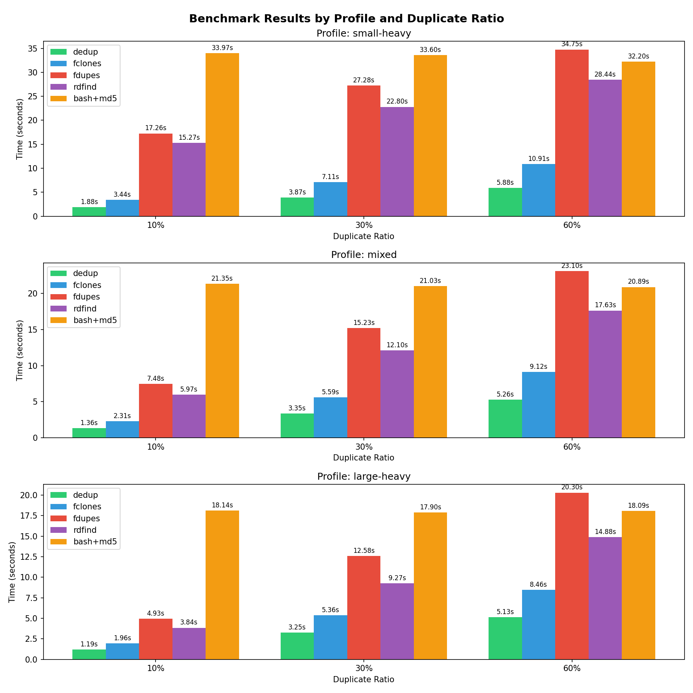
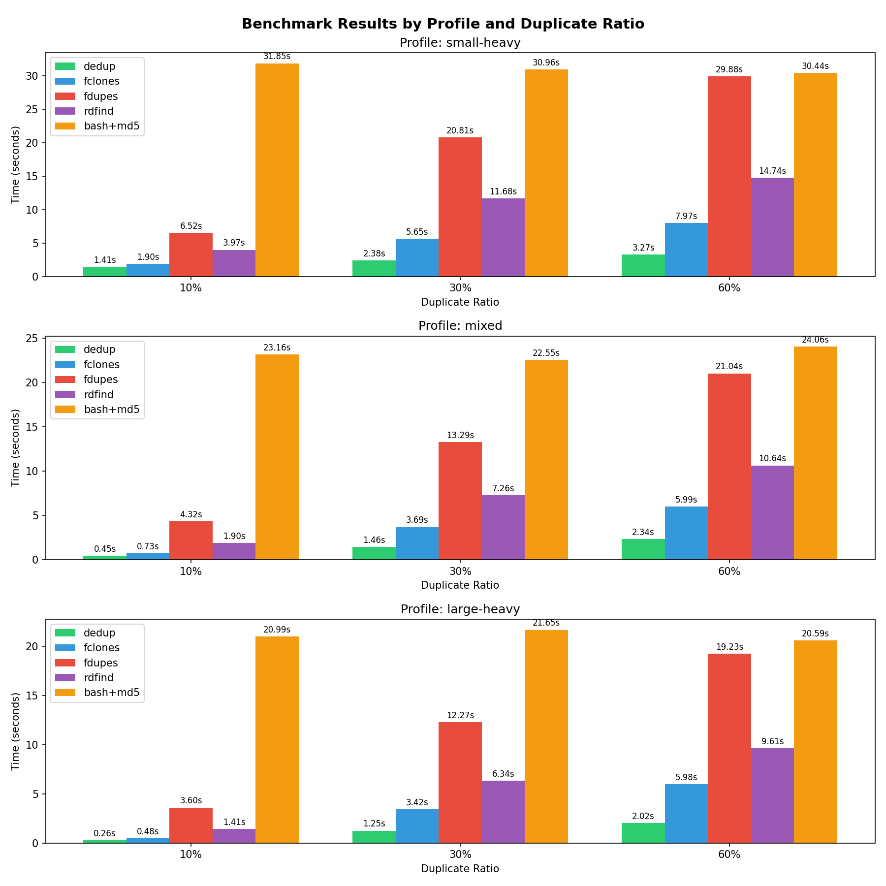

# dedup

An extremely fast and efficient duplicate file finder written in Rust to provide fast and
accurate results while minimizing disk I/O. Available for Linux and macOS with Windows support planned in the future.

Files are compared using cryptographically secure hashing to ensure accuracy.

Optionally, duplicate files can be replaced with hardlinks to save disk space.

## Tree of Contents

- [Features](#features)
- [Installation](#installation)
- [Usage](#usage)
- [CLI Options](#cli-options)
- [Benchmarks](#benchmarks)
- [How It Works](#how-it-works)
- [Hardlinking](#hardlinking)
- [Output Formats](#output-formats)
- [Limitations](#limitations)
- [License](#license)

## Features

- Multi-stage filtering: size grouping -> partial hash (8KB) -> full hash
- Parallel processing with rayon
- BLAKE3 hashing (fast, cryptographically secure)
- Hardlink replacement with dry-run support
- Human-readable and JSON output formats

## Installation

### Cargo

```bash
cargo install dedup-cli
```

### Homebrew

```bash
brew install denizariyan/tap/dedup
```

### From Source

```bash
cargo build --release
```

The binary will be at `target/release/dedup`.

## Usage

```bash
# Scan current directory, report duplicates
dedup

# Scan specific directory
dedup /path/to/directory

# Show each duplicate group (verbose)
dedup -v

# Output as JSON
dedup --format json

# Report duplicates with exit code
dedup --action report-exit-code

# Dry-run replacing duplicates with hardlinks
dedup --action hardlink --dry-run

# Actually replace duplicates with hardlinks
dedup --action hardlink

# Skip files smaller than 1KB
dedup --min-size 1024

# Disable progress bars
dedup --no-progress
```

## CLI Options

All options can be used in combination.

| Option               | Short | Description                                                 |
| -------------------- | ----- | ----------------------------------------------------------- |
| `--format <FORMAT>`  | `-f`  | Output format: `human` (default), `json`, or `quiet`        |
| `--action <ACTION>`  | `-a`  | Action: `none` (default), `report-exit-code`, or `hardlink` |
| `--min-size <BYTES>` | `-s`  | Skip files smaller than this size                           |
| `--verbose`          | `-v`  | Show detailed output with file paths                        |
| `--dry-run`          |       | Preview hardlink changes without modifying files            |
| `--no-progress`      |       | Disable progress bars                                       |

## Benchmarks

Reference benchmark results for a 10GB dataset with various duplicate ratios and file size distributions can be found below.
For more details, see [benchmark docs](benchmark/README.md).

In all tested scenarios, `dedup` outperforms other tested duplicate file finder tools, especially on slower disks where
the multi-stage filtering and parallel computing shines by minimizing the downtime waiting for disk I/O.

### Slow Disk (~500 MB/s read/write)



### Fast Disk (~1.75 GB/s read/write)



## How It Works

The tool uses a multi-stage pipeline to minimize disk I/O to reduce runtime:

1. **Scan**: Walk directory tree, collect file paths and sizes
2. **Size grouping**: Group files by size.
3. **Partial hash**: For remaining candidates, hash only the first 8KB. Group by this partial hash.
4. **Full hash**: For files with matching partial hashes, compute full content hash to confirm duplicates.

This approach avoids reading entire file contents for most files.

Example:

```
1000 files
    ↓ size grouping
  200 candidates (800 unique sizes skipped)
    ↓ partial hash (8KB each)
   50 candidates (150 different starts)
    ↓ full hash
   20 confirmed duplicates
```

## Hardlinking

When using `--action hardlink`, duplicate files are replaced with hardlinks to a single copy.

Note that hardlinking files means the metadata such as file ownership and permissions are lost for the duplicates which are replaced by hardlinks.
It is planned to provide other options in the future, but hardlinking is the only option for now.

If you are packaging the deduplicated files later, consider using a hardlink-aware archiver like `tar` to benefit from space savings.

Use `--dry-run --verbose` first to preview what would change.

## Output Formats

### Human (default)

```
Duplicate Report
  Groups: 3
  Total duplicate files: 12
  Wasted space: 45.2 MB
```

### Quiet

Suppresses all output. Useful for scripting in combination with `--action report-exit-code`.

### JSON

```json
{
  "stats": {
    "duplicate_groups": 3,
    "duplicate_files": 12,
    "wasted_bytes": 47412224
  },
  "groups": [
    {
      "size": 15804074,
      "files": ["/path/to/file1.jpg", "/path/to/file2.jpg"]
    }
  ]
}
```

## Limitations

- Because Hardlinks are the only deduplication method currently supported, only files within the same filesystem can be deduplicated
- Symlinks are ignored

## License

MIT License. See `LICENSE` file for details.
